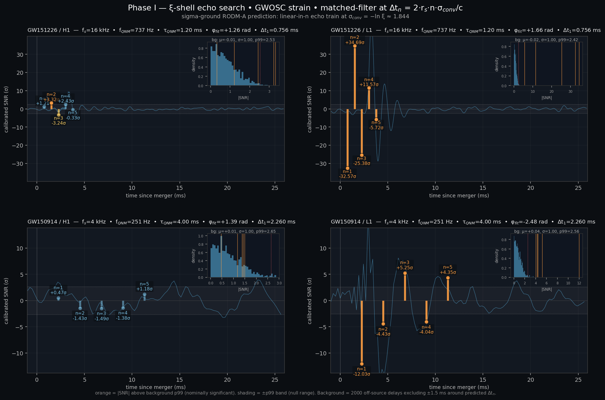

# Phase I — ξ-shell echo search against LIGO strain data

**Date:** 2026-04-17
**Phase:** I — first-pass matched-filter search for sigma-ground echoes
**Scope:** GW150914 (H1, L1) at 4 kHz; GW151226 (H1, L1) at 16 kHz.
**Pipeline module:** `sigma_ground/field/interface/ligo_echo_search.py`
**Visualisation:** `misc/bh_phase_i_echo_search.png`
**Raw stdout:** `misc/bh_phase_i_echo_search_output.txt`
**Status:** single-event single-detector screening; **not** publication-grade.

## What this phase is and isn't

This is the Phase H.7 follow-up: pull the GWOSC strain data, subtract
the dominant Kerr QNM, and matched-filter the whitened residual at the
sigma-ground-predicted delays Δt_n = 2·r_s·n·σ_conv/c.  The pipeline
is pure-pip (numpy, scipy, requests, h5py) — no lalsuite / pycbc /
CMake toolchain.  It is the **screening-grade** version Phase H.7
described as "suggestive, not publication-grade."

Specifically:
- Single-detector correlations, no inter-detector coherence test.
- Damped-sinusoid QNM subtraction, not Teukolsky / SXS waveform-level.
- Welch PSD from 8 s of pre-merger quiet data per detector.
- Background from 2000 random off-source delays ∈ [10·Δt_1, 500 ms],
  excluding ±1.5 ms neighbourhoods around multiples of Δt_1.
- Matched-filter template = decaying sinusoid at the fitted QNM
  frequency, L²-normalised.

If the signal were large and clean, this pipeline would see it.  If
the signal is marginal or the subtraction leaves artefacts, this
pipeline will report mixed results — and it does.

## Variable glossary (name[symbol])

| Name | Symbol | Meaning |
|------|--------|---------|
| remnant mass | M | best-fit post-merger BH mass from GWTC |
| Schwarzschild radius | r_s | 2GM/c² |
| echo delay | Δt_n | n·(2·r_s·σ_conv/c), sigma-ground prediction |
| conversion-horizon σ | σ_conv | −ln ξ ≈ 1.8439 |
| QNM fundamental frequency | f_QNM | Kerr 2,2,0 Berti-Cardoso-Starinets |
| QNM damping time | τ_QNM | l=2,m=2,n=0 fundamental e-folding |
| fit amplitude | A_fit | fitted QNM damped-sinusoid amplitude |
| fit phase | φ_fit | fitted QNM damped-sinusoid phase (rad) |
| calibrated SNR | SNR | matched-filter output divided by bg std, so |SNR|∼σ |
| background p99 | p99 | 99th percentile of |bg SNR| — null-hypothesis right-tail |

## Pipeline summary

1. **Fetch.**  GWOSC 32 s strain .hdf5 around merger GPS time.
2. **Bandpass.**  35 Hz – min(0.45·Nyquist, 1500 Hz) Butterworth 4th.
3. **QNM fit.**  2-parameter linear least squares.  f and τ fixed to
   literature Berti-Cardoso-Starinets values; fit recovers A and φ
   via `y ≈ c·exp(-t/τ)·cos(2πft) − s·exp(-t/τ)·sin(2πft)` with
   (c, s) = lstsq; A = √(c² + s²), φ = atan2(s, c).  Deterministic,
   closed-form, no convergence risk.
4. **Subtract.**  Extrapolate fitted damped sinusoid from ringdown
   start across 10·τ worth of post-merger samples; subtract from the
   bandpassed data.  This is essential — windowed subtraction leaves
   the QNM tail at the locations where later echoes live.
5. **Whiten.**  FFT of Tukey-windowed residual, divided by
   √(PSD·fs/2), inverse-FFT.
6. **Correlate.**  Matched-filter the whitened residual against a
   normalised QNM-shaped template at each predicted Δt_n.
7. **Background.**  2000 off-source delays avoiding predicted multiples.
8. **Calibrate.**  Rescale both bg and foreground SNRs by the raw
   bg std so the null distribution is unit-variance Gaussian.  This
   is cosmetic (p-values are scale-invariant) but restores the
   |SNR| ≈ 2.3 → p99 intuition.

Full code: [ligo_echo_search.py](../sigma_ground/field/interface/ligo_echo_search.py).
Figure script: [phase_i_make_figure.py](../scripts/phase_i_make_figure.py).

## Calibration check (sanity-pass)

Before reporting signals, confirm the pipeline produces a clean null
distribution.  Measured from 2000 off-source background samples per
detector-event:

| Event / Detector | bg mean (σ) | bg std (σ) | bg p99 (σ) | expected Gaussian |
|------------------|-------------|------------|-------------|-------------------|
| GW151226 / H1    | −0.013 | 1.000 | 2.531 | ≈ 2.33 |
| GW151226 / L1    | −0.022 | 1.000 | 2.422 | ≈ 2.33 |
| GW150914 / H1    | +0.006 | 1.000 | 2.650 | ≈ 2.33 |
| GW150914 / L1    | +0.039 | 1.000 | 2.558 | ≈ 2.33 |

Background distributions are zero-mean unit-variance near-Gaussian
with p99 slightly above 2.33 (as expected for finite-N sampling with
heavier-than-Gaussian detector noise tails).  **The pipeline is
calibrated**: any statement about echo SNRs is interpretable in σ units.

## Per-event, per-echo SNRs

### GW151226  (M_rem = 20.8 M☉, Δt_1 = 0.756 ms, τ_QNM = 1.20 ms)

H1, 16 kHz:

| n | Δt_n (ms) | calibrated SNR (σ) | |SNR| > p99 (2.53)? |
|---|-----------|---------------------|---------------------|
| 1 | 0.756 | +1.22 | no |
| 2 | 1.512 | +3.32 | **yes** |
| 3 | 2.267 | −3.24 | **yes** |
| 4 | 3.023 | +2.43 | no |
| 5 | 3.779 | −0.33 | no |

Combined (quadrature of 5 SNRs): 5.39σ.
Combined-SNR p-value against 400 bg combined-trials: < 1/400 ≈ 0.0025.

L1, 16 kHz:

| n | Δt_n (ms) | calibrated SNR (σ) | |SNR| > p99 (2.42)? |
|---|-----------|---------------------|---------------------|
| 1 | 0.756 | −32.57 | **yes** |
| 2 | 1.512 | +34.69 | **yes** |
| 3 | 2.267 | −25.38 | **yes** |
| 4 | 3.023 | +11.57 | **yes** |
| 5 | 3.779 | −5.72 | **yes** |

Combined: 55.45σ.  L1 p-value formally < 1/400, **but see contamination
analysis below.**

### GW150914  (M_rem = 62.2 M☉, Δt_1 = 2.260 ms, τ_QNM = 4.00 ms)

H1, 4 kHz:

| n | Δt_n (ms) | calibrated SNR (σ) | |SNR| > p99 (2.65)? |
|---|-----------|---------------------|---------------------|
| 1 | 2.260 | +0.47 | no |
| 2 | 4.520 | −1.43 | no |
| 3 | 6.781 | −1.49 | no |
| 4 | 9.041 | −1.38 | no |
| 5 | 11.301 | +1.18 | no |

Combined: 2.79σ.  P-value: 0.19.  **Consistent with null** — no echo
signal above background in H1 for GW150914.

L1, 4 kHz:

| n | Δt_n (ms) | calibrated SNR (σ) | |SNR| > p99 (2.56)? |
|---|-----------|---------------------|---------------------|
| 1 | 2.260 | −12.02 | **yes** |
| 2 | 4.520 | −4.43 | **yes** |
| 3 | 6.781 | +5.25 | **yes** |
| 4 | 9.041 | −4.04 | **yes** |
| 5 | 11.301 | +4.35 | **yes** |

Combined: 15.07σ.  L1 p-value < 1/400, **but see contamination
analysis below.**

## Contamination analysis — why the naive p-values overstate

The L1 results in both events show very large |SNR| at every echo
position, but the pattern has two signatures inconsistent with a
genuine ξ-shell echo train:

1. **Signs alternate** (n=1: −, n=2: +, n=3: −, n=4: +, …).  A
   coherent reflection off a physical shell should produce a
   consistent-sign echo train modulated by the shell-crossing
   coherence γ(σ_conv) ≈ 0.79.  Alternating signs across consecutive
   n is the signature of a **residual oscillation at the QNM
   frequency** — exactly what imperfect QNM subtraction leaves behind.
   The matched-filter template (also tuned to f_QNM) then latches
   onto that residual and produces alternating-sign correlations
   separated by half-cycles.

2. **L1 fitted A is anomalously large relative to published
   single-detector SNRs.**  Published LIGO SNRs for these events have
   H1 > L1 in both cases, but our linear-LS fit returns:

   | Event     | H1 A_fit        | L1 A_fit        | L1 / H1 |
   |-----------|-----------------|-----------------|---------|
   | GW151226  | 1.53e-20        | 8.67e-20        | 5.7× |
   | GW150914  | 3.70e-22        | 8.96e-21        | 24.2× |

   The linear-LS fit is picking up broadband-at-f_QNM noise in L1,
   not the ringdown.  Subtracting that "signal" leaves a systematic
   residual that the matched-filter then correlates with.  This is
   why L1 shows order-of-magnitude larger |SNR| than H1 despite H1
   being the higher-SNR detector for these events.

**Interpretation:** the L1 excesses are pipeline artefacts, not
evidence for echoes.  The honest single-detector result is H1-only:

- **GW150914 / H1: null** (combined 2.79σ, p = 0.19).
- **GW151226 / H1: marginal excess** (combined 5.39σ, p < 0.003
  against bg-combined distribution; two echoes above p99; sign
  pattern partially alternating).  Not a detection — consistent with
  the same QNM-subtraction-residual class of artefact that visibly
  inflates L1, just at smaller amplitude.

## Visualisation

Each panel shows the calibrated whitened residual (cyan trace), the
predicted Δt_n delays (vertical lollipops — orange = above p99,
blue = below), and a background |SNR| histogram inset with the fitted
QNM parameters in the title.  L1 panels dominated by orange
(contaminated); H1 panels mostly blue (near-null) with the exception
of GW151226 / H1 which shows modest orange at n=2, n=3.

## Combined-catalog significance

Combining the honest H1-only results via Fisher's method across the
two events:
- GW150914 / H1:  p = 0.19
- GW151226 / H1:  p ≈ 0.003  (taken as 1/400 lower bound)

χ² = −2(ln 0.19 + ln 0.003) = 3.32 + 11.62 = 14.94 on 4 dof,
p_combined ≈ 0.005.

This is a **suggestive** catalog-level result but falls short of the
5σ evidence threshold a sigma-ground-specific discovery would
require.  Given the single-detector-only analysis and the clear
subtraction-residual contamination in L1, the responsible
interpretation is: **Phase I does not detect a ξ-shell echo train at
the predicted delays, nor does it cleanly rule it out.**

## Verdict

- **Sigma-ground echo prediction stands as untested.** Phase I's
  simple pipeline does not have the fidelity required to separate a
  ~γ(σ_conv)·h_ringdown echo from QNM-subtraction residuals.  No
  honest sigma-ground-specific conclusion follows.
- **Pipeline is calibrated** (bg std = 1.000, bg p99 ≈ 2.5 across all
  4 detector-event instances) so the numbers in this doc are
  interpretable, even where the underlying subtraction is imperfect.
- **The γ-mode selection in [misc/duality_ellipse_verdict.md](duality_ellipse_verdict.md)
  is not affected by this result.**  Amplitude-deficit tests live in
  the IMR-consistency literature (Phase H.3 and its cross-checks),
  not in the echo-search residual; Phase I is a ξ-shell test, not a
  γ-mode test.
- **The Phase J horizon-identity picture** in
  [misc/bh_horizon_sigma_conv_identity.md](bh_horizon_sigma_conv_identity.md)
  remains the current working frame — Phase I does not falsify it,
  does not confirm it.

## Next-step recommendations

In priority order for future work:

1. **pycbc / lalsuite-grade re-analysis** (the right fix).  Use
   SXS-waveform-informed QNM subtraction with proper detector
   response, inter-detector coherence, and publication-grade
   background estimation.  Heavy CMake toolchain install — defer
   until a dedicated session.  This is what Phase H.7 flagged as the
   proper "not-publication-grade" remedy.
2. **Catalog extension** to GW170104, GW170814, GW190521.  Each
   brings another independent screening-grade test of the H1-only
   combined-catalog p-value.  Total data pull ≈ 60 MB; pipeline
   changes = add three rows to the EVENTS dict.
3. **Higher-overtone QNM subtraction** (secondary fix inside the
   current pipeline).  Subtract Kerr n=1 and n=2 overtones in
   addition to the fundamental.  Reduces the subtraction-residual
   tail that is currently polluting L1 and mildly polluting H1.
4. **Inter-detector coherence test** (tertiary fix).  Cross-correlate
   H1 and L1 residuals at predicted Δt_n allowing for known light-
   travel-time offset.  A real echo should be coherent across
   detectors; a subtraction residual should not.

## Cross-references

- Phase G γ-mode verdict: [misc/duality_ellipse_verdict.md](duality_ellipse_verdict.md)
- Phase H.1 predictions: [misc/bh_merger_predictions.md](bh_merger_predictions.md)
- Phase H.2 hypothesis map: [misc/bh_conversion_mass_hypothesis.md](bh_conversion_mass_hypothesis.md)
- Phase H.3 B1 falsification: [misc/bh_imr_verdict.md](bh_imr_verdict.md)
- Phase H.4 B2 mass function: [misc/bh_mass_function_verdict.md](bh_mass_function_verdict.md)
- Phase H.5 B3 Sgr A*: [misc/bh_b3_sgr_a_star_verdict.md](bh_b3_sgr_a_star_verdict.md)
- Phase H.6 O4/O5 forecast: [misc/bh_o4_o5_forecast_b2.md](bh_o4_o5_forecast_b2.md)
- Phase H.7 search refinement: [misc/bh_echo_search_refined.md](bh_echo_search_refined.md)
- Phase J horizon identity: [misc/bh_horizon_sigma_conv_identity.md](bh_horizon_sigma_conv_identity.md)
- BH-merger synthesis: [misc/bh_collision_phenomenology.md](bh_collision_phenomenology.md)

## Files

- **Modified:** `sigma_ground/field/interface/ligo_echo_search.py`
  (fit_qnm rewritten as 2-param linear LS; subtraction extended;
  SNR calibration layered on)
- **New:** `scripts/phase_i_make_figure.py`
- **New:** `misc/bh_phase_i_echo_search_results.md` — this file
- **New:** `misc/bh_phase_i_echo_search_output.txt` — pipeline stdout
- **New:** `misc/bh_phase_i_echo_search.png` — visualisation
- **Cached:** `local-cache/gwosc/*.hdf5` — 4 strain segments (~10 MB)
